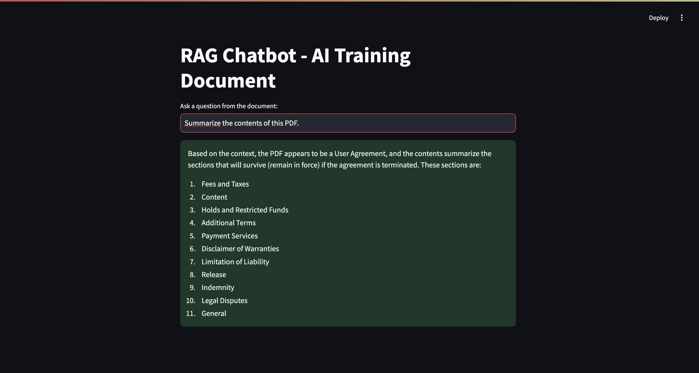

# 🤖 RAG Chatbot – AI Training Document Assistant

This project implements a Retrieval-Augmented Generation (RAG) chatbot that allows users to ask questions based on a provided PDF. The chatbot uses LLaMA 3 via Groq API for answering and stores chunked embeddings in a vector database (Chroma) for efficient retrieval.

---

## 🧱 Project Architecture & Flow

```mermaid
graph TD
    A[PDF Upload] --> B[Chunker (text splitter)]
    B --> C[Embeddings (MiniLM)]
    C --> D[Chroma Vector Store]
    E[User Query] --> F[Retriever + Prompt Builder]
    D --> F
    F --> G[Groq LLaMA 3 (via API)]
    G --> H[Streamlit Chat UI (with Streaming)]
```

- PDF is chunked using `RecursiveCharacterTextSplitter`
- Embeddings are generated using `sentence-transformers/all-MiniLM-L6-v2` 
- Vector database (Chroma) stores all chunk embeddings
- User query triggers top-k similarity retrieval
- LLM receives a prompt constructed from those chunks
- Chatbot response is streamed in real-time via Streamlit

---

## ⚙️ Preprocessing & RAG Pipeline Steps

### 🧩 Step 1: Chunk PDF
```python
from src.chunker import load_and_chunk
chunks = load_and_chunk("data/AI_Training_Document.pdf", "chunks/")
```

### 🧠 Step 2: Generate Embeddings
```python
from src.embedder import create_vector_store
create_vector_store(chunks, "vectordb/")
```

### 🔁 Step 3: Load Vector Store and Setup QA
```python
from src.embedder import load_vector_store
from src.qa import get_qa_chain

vectordb = load_vector_store("vectordb/")
qa_chain = get_qa_chain(vectordb, groq_api_key="your_key_here")
```

---

## 🧠 Model & Embedding Choices

| Component     | Choice                                 | Reason |
|---------------|----------------------------------------|--------|
| **LLM**       | LLaMA 3-70B via [Groq API](https://console.groq.com) | Open-source, ultra-fast inference |
| **Embeddings**| sentence-transformers/`all-MiniLM-L6-v2` is fast and local |
| **Vector DB** | Chroma                                 | Easy local persistence and retrieval |
| **Frontend**  | Streamlit                              | Clean UI, real-time interaction |
| **Framework** | LangChain                              | For chunking, retrieval, and chain setup |

---

## 🚀 How to Run the Chatbot (with Streaming)

### 1. Install dependencies
```bash
pip install -r requirements.txt
```

### 2. Add API Keys to `.env`
```env
GROQ_API_KEY=your_groq_key_here
```

### 3. Automatically Generated Folders

These folders will be auto-created when you run the app for the first time:

- `chunks/` – contains auto-generated chunk text files from the PDF  
- `vectordb/` – stores vector embeddings used by ChromaDB

### 4. Place your PDF in `data/`
```bash
data/AI_Training_Document.pdf
```

### 5. Launch Streamlit app
```bash
streamlit run app.py
```

---

## 💬 Sample Queries to Try

- What is this document about?
- What model should I use for this task?
- What are the deliverables expected from this assignment?
- How does the RAG pipeline work?
- What kind of chatbot is expected?

---

## 🎥 Demo 

These are some screenshots:



---

## 📁 Project Structure

```
rag_chatbot_project/
├── app.py
├── .env
├── data/
│   └── AI_Training_Document.pdf
├── chunks/
├── vectordb/
├── src/
│   ├── chunker.py
│   ├── embedder.py
│   └── qa.py
├── requirements.txt
└── README.md
```

---

## ✅ Assignment Ready

This chatbot satisfies the following requirements:
- Uses open-source LLM via Groq
- Streams answers in real-time using Streamlit
- Loads and retrieves from embedded PDF chunks
- Modular architecture for preprocessing, vectorization, and inference
